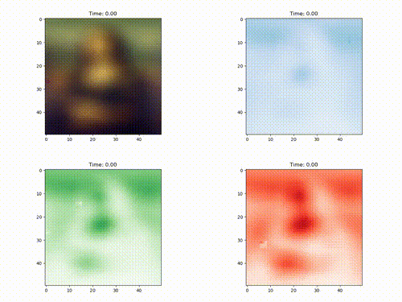

# Demo  
<p align="center">
  
</p>

# Project Setup and Usage

## Cloning the Repository
To clone this repository along with its submodules:
```bash
git clone --recurse-submodules https://github.com/PDesa16/Cell-DEVS-Memory-Networks.git
```

## Traverse to Project Directory
```bash
cd Cell-DEVS-Memory-Networks
```

## Give Permissions to the Build Script
```bash
chmod 755 build_dependencies.sh
```

## Building Dependencies
Before building the project, install the necessary dependencies:
```bash
./build_dependencies.sh
```

## Building the Project
To build all tests:
```bash
make build_all
```

You can also build individual components:
```bash
make build_test_model_builder
make build_simulation
```

## Running the Simulation
To run the simulation:
```bash
make run_simulation
```

## Cleaning Up
To clean up compiled binaries:
```bash
make clean
```

# JSON File and Simulation Explanation

The simulation configuration file is located at:

```
config/simulation_config.json
```

Example configuration:
```json
{
  "simulation_type": "Hebb",
  "scenario": {
    "shape": [50, 50],
    "origin": [0, 0],
    "wrapped": false
  },
  "cells": {
    "default": {
      "delay": "inertial",
      "model": "Hebbian-Learning",
      "neighborhood": [
        { "type": "von_neumann", "range": 1 }
      ]
    }
  },
  "simulation_details": {
    "name": "Varying Neighborhood",
    "image_selection": 0
  }
}
```

## Configuration Fields Overview
| **Field** | **Meaning** |
|:---|:---|
| `simulation_type` | Selects which memory model to run (`Hebb`, `Hopfield`, `ModernHopfield`, `Field`). |
| `scenario.shape` | Specifies the grid dimensions: `[width, height]`. |
| `scenario.origin` | Starting coordinate of the grid (usually `[0, 0]`). |
| `scenario.wrapped` | Whether the grid wraps around at edges (toroidal behavior if true). |
| `cells.default.delay` | Type of delay model for each cell (`inertial` recommended). |
| `cells.default.model` | Name of the cell model (e.g., `"Hebbian-Learning"`). |
| `cells.default.neighborhood` | Defines the neighborhood type (`"von_neumann"`, `"moore"`) and range. |
| `simulation_details.name` | Friendly name for the simulation (used for logs and graphs). |
| `simulation_details.image_selection` | Which input image index to use as the ground truth. |
